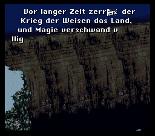

# Final Fantasy III (US) German fan translation by Ramsis/ManuLöwe

## DISCLAIMER

All trademarks mentioned in this readme file are the properties of their respective owners.

This software is freeware. It is provided "as is" and without express or implied warranty of any kind. Ramsis/ManuLöwe will not be held liable or responsible for any losses, damages, injuries, and/or legal consequences due to the use, misuse and/or illegal use of any of the files contained within this repository.

## ABOUT THIS PROJECT

The goal of this project is to re-implement my old fan translation of Final Fanasy III (US) into German using 65816 assemby tools like WLA DX, and (possibly) to refine/improve it for an even better German-language experience than was offered before. Yes, I'm fully aware of the fact that my translation is obsolete in many ways and that by today's standards, it can be considered mediocre at best. Please bear in mind that the project was initially completed in 2002 and that the latest revision v1.40 released as far back as 2008 (IPS format). So yeah, it's old.

If you'd still like to play a complete version of my translation despite all this, you may download a newly created [v1.40 BPS patch](https://github.com/Ramsis-SNES/fan-translation-ff3us-ger/tree/master/patch) from this repository which has been updated to include a fix for the infamous font color adjustment bug in the Config menu. The patch with "oldfont" in the name features the original game font, while the "newfont" one will please your eyes with some Schnörkelfont. (Ignore the `release` folder for now, this only contains the original 2012 re-release of v1.40 with patches in xdelta format for posterity. These patches obviously still contain the font color adjustment bug.)

A brand-new version may be released at some point in the future; as of now, however, if you care to experience the current bleeding-edge, totally incomplete/unstable/buggy status of the project (a tentative v1.50), you would need to clone this repository and build a ROM file for yourself. There is not much point in doing so, and I strongly suggest you instead wait for a new patch to release if you are so inclined.

## V1.50 PROGRESS

What's (not) been done so far (all percentage values are guesstimates):

| Task                            | Complete                   |
| :-----------                    | -------------------------: |
| Dialogue Edit¹                  |   1 % |
| Dialogue Insertion              |  99 % |
| Items etc.                      |  40 % |
| Menu                            |   0 % |
| Font Expansion (Umlauts)        |   0 % |
| Graphics                        |   0 % |
| Misc. Elements                  |   0 % |
| FF6 Title Screen (optional)     | 100 % |
| Programming                     |  20 % |
| Misc. Stuff (e.g. Readme)       |   5 % |

¹ Current dialogue text is based on a partial 2014 revision that never resulted in a new patch release.

Also note that the "Schnörkelfont" patch will be discontinued as it's too much of a hassle to maintain both versions.

## TECHNICAL DETAILS

Up until the v1.40 release back in 2008/2012, this translation used to be worked on using a hex editor dedicated to translating game ROMs known as SNESEdit. It allowed editing dialogue, miscellaneous text, pointers and even graphics data directly, i.e. permanently modifying the ROM file in the process. All of the relevant development files used for translating the game reside in the two directories starting with `snesedit_` for quick & easy reference (except for the graphics, which were modified using other tools).

While tremendously useful and versatile at the time, when it comes to a more modern, non-destructive workflow involving script/asset dumps and custom programming (a.k.a. ASM hacks) for maximum flexibility, the capabilities of both SNESEdit and other translation-focused hex editors as well as tile editors were, in fact, limited simply by the purpose and design of that kind of software. For this reason—not to mention the fact that most of this older software isn't developed any more and will not run correctly, if at all, on modern operating systems—it seemed logical to convert the translation data files to a format usable by a powerful modern cross assembler like WLA DX, making it possible to apply changes and especially bugfixes much more efficiently than back in the day.

## HOW TO USE BPS FILES

Read your emulator's docs to check whether it supports on-the-fly BPS patching. Or, grab a tool named Floating IPS, or [Flips](https://git.disroot.org/Sir_Walrus/Flips) for short. Please be aware that the [original repo](https://github.com/Alcaro/Flips) was made read-only for some weird reason, and most places distributing binaries are stuck with v1.31 ... very odd. Still, Flips is self-explanatory and easy to use, and even v1.31 should work just fine in most cases.

The original Final Fantasy III (US) ROM must be v1.1 of the game, and it must not have a copier header (file size: exactly 3,145,728 bytes, checksum: 0x8A60, CRC32: C0FA0464).

## BUILDING REQUIREMENTS

- [asar](https://github.com/RPGHacker/asar) v1.91
- [Final Fantasy VI C2FF6D (de)compressor](https://www.romhacking.net/utilities/1176/) and Perl v5
- [Flips](https://git.disroot.org/Sir_Walrus/Flips) v1.31+
- [Gnu Make](https://www.gnu.org/software/make/)
- [superfamicheck](https://github.com/Optiroc/SuperFamicheck) v1.1.0
- [WLA DX](https://github.com/vhelin/wla-dx) v10.7 (earlier versions won't work as this project relies on newer assembler features)

## QUESTIONS, COMMENTS ...

... will be ignored (for now). :stuck_out_tongue:

## THANKS

- [abw](https://www.romhacking.net/community/912/) for Final_Fantasy_VI_7E5000_from_C2686C.asm and "Final Fantasy VI C2FF6D (de)compressor"
- [devinacker](https://github.com/devinacker) for bsnes-plus
- [everything8215](https://github.com/everything8215) for "Disassembly and ROM info for Final Fantasy VI"
- [vhelin](https://github.com/vhelin) for WLA DX, the best multi-platform cross assembler out there :D

### (c) 2025 by Ramsis/ManuLöwe | https://github.com/Ramsis-SNES/
